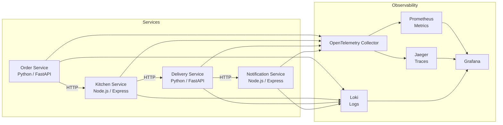

# Food Delivery Tracker — Observability Learning Project

A minimal 4-service food delivery simulation designed to generate rich observability data: distributed traces, Prometheus metrics, and structured JSON logs. The goal is **learning**, not production-grade code — services are intentionally thin.

---

## Architecture Overview



**Flow:** A simulated order triggers a chain: `Order → Kitchen → Delivery → Notification`. Each hop propagates a W3C `traceparent` header, producing a single end-to-end trace.

---

## Proposed Changes

### Project Structure [NEW]

```
observability-course/
├── docker-compose.yml
├── .env
├── services/
│   ├── order-service/          # Python / FastAPI
│   ├── kitchen-service/        # Node.js / Express
│   ├── delivery-service/       # Python / FastAPI
│   └── notification-service/   # Node.js / Express
├── observability/
│   ├── otel-collector-config.yml
│   ├── prometheus.yml
│   └── grafana/
│       └── provisioning/       # Datasources + dashboards
└── simulator/                  # Traffic generator script
    └── simulate.py
```

---

### Service 1 — Order Service [NEW] `services/order-service/`

**Language:** Python 3.12 + FastAPI + `opentelemetry-sdk`

| Endpoint | Description |
|---|---|
| `POST /orders` | Creates an order, calls Kitchen Service |
| `GET /orders/{id}` | Returns order status |
| `GET /health` | Health check |

- Stores orders in-memory (dict) — no DB needed
- Introduces a **random artificial delay** (50–300ms) to simulate processing
- Emits: traces (OTLP), Prometheus metrics via `/metrics`, structured JSON logs to stdout

---

### Service 2 — Kitchen Service [NEW] `services/kitchen-service/`

**Language:** Node.js 20 + Express + `@opentelemetry/sdk-node`

| Endpoint | Description |
|---|---|
| `POST /prepare` | Accepts an order, simulates food prep (random delay 1–5s), calls Delivery |
| `GET /health` | Health check |

- Simulates preparation with `setTimeout`
- Randomly fails 10% of orders to generate error spans

---

### Service 3 — Delivery Service [NEW] `services/delivery-service/`

**Language:** Python 3.12 + FastAPI

| Endpoint | Description |
|---|---|
| `POST /assign` | Assigns a (fake) driver, simulates pickup delay, calls Notification |
| `GET /deliveries/{id}` | Returns delivery status |
| `GET /health` | Health check |

- Generates fake GPS coordinates (lat/lng updated over time)
- Emits a `delivery.duration_seconds` histogram metric

---

### Service 4 — Notification Service [NEW] `services/notification-service/`

**Language:** Node.js 20 + Express

| Endpoint | Description |
|---|---|
| `POST /notify` | Logs the notification (no real email/SMS) |
| `GET /health` | Health check |

- Purely a log sink — demonstrates how logs correlate with trace IDs
- Emits a `notifications_sent_total` counter

---

### Observability Stack [NEW] `docker-compose.yml`

| Tool | Role | Port |
|---|---|---|
| **Jaeger** (all-in-one) | Trace backend | `16686` (UI) |
| **OpenTelemetry Collector** | OTLP fan-out | `4317` (gRPC) |
| **Prometheus** | Metrics scraping | `9090` |
| **Loki** | Log aggregation | `3100` |
| **Promtail** | Log shipper (Docker logs) | — |
| **Grafana** | Unified UI | `3000` |

---

### Traffic Simulator [NEW] `simulator/simulate.py`

Simple Python script that POSTs to `Order Service` in a loop with random items, restaurants, and addresses. Run it to populate the observability stack with data.

```bash
python simulator/simulate.py --rate 1  # 1 order/second
```

---

## Key Observability Patterns Covered

| Pattern | Where |
|---|---|
| Distributed trace (HTTP propagation) | All 4 services |
| Span attributes (order ID, driver ID) | Order + Delivery |
| Error spans | Kitchen (10% failures) |
| Custom metrics (histograms, counters) | All services |
| Log → Trace correlation (via `trace_id`) | All services |
| Health endpoints for uptime monitoring | All services |

---

## Verification Plan

### Automated
- Each service exposes `GET /health` — checked at Docker Compose startup via `healthcheck`
- Simulator script verifies the full chain completes without HTTP errors

### Manual
1. `docker compose up -d` — all containers start green
2. Run `python simulator/simulate.py` for ~30 seconds
3. Open **Jaeger UI** at `http://localhost:16686` → find a trace spanning all 4 services
4. Open **Grafana** at `http://localhost:3000` → confirm Prometheus metrics and Loki logs appear
5. Trigger a kitchen failure (visible as a red error span in Jaeger)
